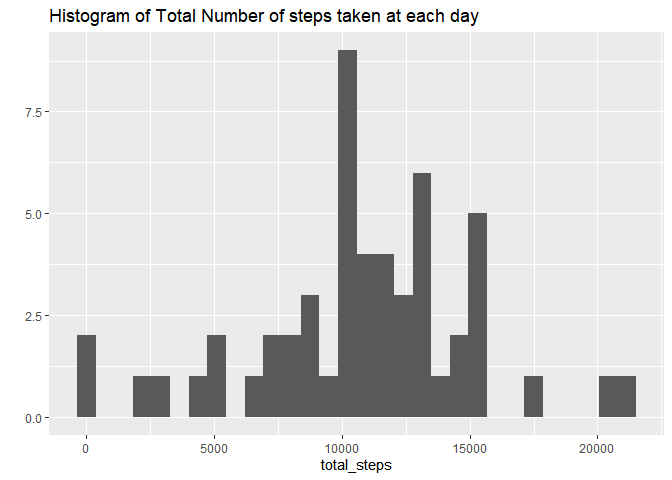
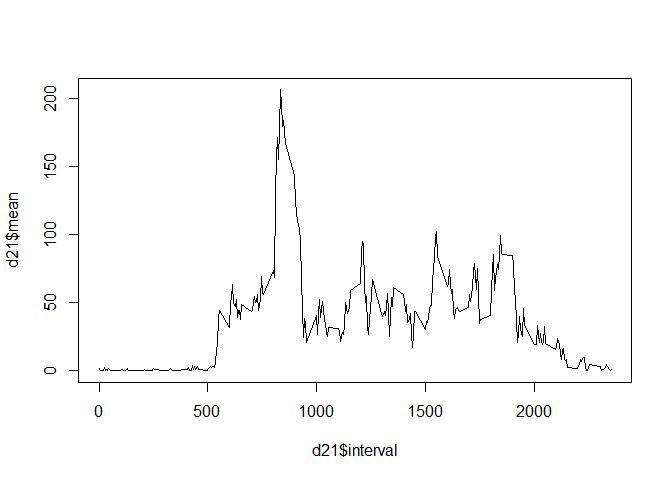
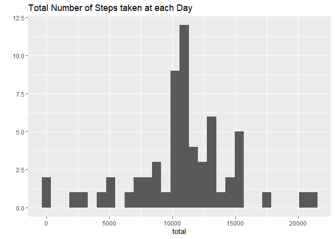
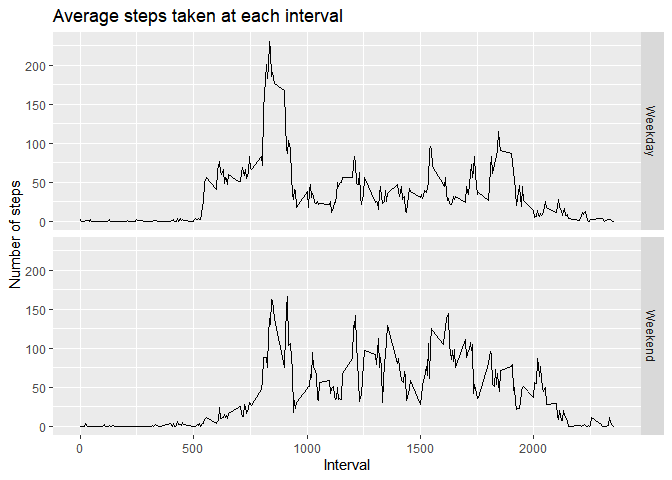

#Personal Activity Monitoring Data Analysis


### Downloading and Importing Dataset


```r
url= "https://d396qusza40orc.cloudfront.net/repdata%2Fdata%2Factivity.zip"
download.file(url, "rr.zip")
unzip("rr.zip") 
d = read.csv("activity.csv")
head(d)
```

```
##   steps       date interval
## 1    NA 2012-10-01        0
## 2    NA 2012-10-01        5
## 3    NA 2012-10-01       10
## 4    NA 2012-10-01       15
## 5    NA 2012-10-01       20
## 6    NA 2012-10-01       25
```

```r
str(d)
```

```
## 'data.frame':	17568 obs. of  3 variables:
##  $ steps   : int  NA NA NA NA NA NA NA NA NA NA ...
##  $ date    : Factor w/ 61 levels "2012-10-01","2012-10-02",..: 1 1 1 1 1 1 1 1 1 1 ...
##  $ interval: int  0 5 10 15 20 25 30 35 40 45 ...
```

### Calculating total , mean and median of steps taken each day

I have used *dplyr* to aggregate for each day.


```r
library(dplyr)
```

```
## 
## Attaching package: 'dplyr'
```

```
## The following objects are masked from 'package:stats':
## 
##     filter, lag
```

```
## The following objects are masked from 'package:base':
## 
##     intersect, setdiff, setequal, union
```

```r
d11= d %>% 
  group_by(date)%>%
  summarize(total_steps= sum(steps) )
head(d11)
```

```
## # A tibble: 6 x 2
##   date       total_steps
##   <fct>            <int>
## 1 2012-10-01          NA
## 2 2012-10-02         126
## 3 2012-10-03       11352
## 4 2012-10-04       12116
## 5 2012-10-05       13294
## 6 2012-10-06       15420
```
### Histogram of the total number of steps taken each day
Above aggregated data is used to plot the histogram of the total number of steps taken each day. 


```r
library(ggplot2)
qplot( total_steps, data= d11, geom = "histogram" , 
       main ="Histogram of Total Number of steps taken at each day")
```

```
## `stat_bin()` using `bins = 30`. Pick better value with `binwidth`.
```

```
## Warning: Removed 8 rows containing non-finite values (stat_bin).
```

<!-- -->

### Mean and median number of steps taken each day


```r
a= mean(d11$total_steps, na.rm=TRUE)
a
```

```
## [1] 10766.19
```

```r
median_day = median(d11$total_steps, na.rm=TRUE)
```

The mean steps taken per day is 10766.1886792453 and the median steps taken per day is 10765.

### Calculating average daily activity pattern
Analogous to aggregating for each day, now the data is grouped for each interval using *dplyr*. 


```r
d21= d%>%
  group_by(interval)%>%
  summarize(mean = mean(steps, na.rm= TRUE))
```

### Time series plot of the average number of steps taken
Using the above data we now plot time series of average number of steps.


```r
plot(d21$interval, d21$mean, type="l")
```

<!-- -->
### The 5-minute interval that, on average, contains the maximum number of steps
For this, I have filtered the observation corresponding to the maximum number of steps and then subset its *steps* column.


```r
max=as.numeric(filter(d21, d21$mean==max(d21$mean))[1,1])
max
```

```
## [1] 835
```
The 5-minute interval, on average across all the days in the dataset that contains the maximum number of steps is 835.
### Missing Values 

```r
sum(is.na(d))
```

```
## [1] 2304
```
There exists missing values in our data and that may bias our decisions. For fixing this mean imputation is used to fill in the missing values for the data.

### Imputation of Missing Values through mean for that 5min interval 
Average for each 5 min interval has already been calculated in dataset d21 ignoring NA values. For filling in those, for loop is used. 


```r
#Creating an empty vector
nstep= c()

for(i in 1: 17568){
  if (is.na(d[i,1])==TRUE) {
    nstep[i]= filter(d21, d21$interval== d[i,3] ) [1,2]
  } else {
    nstep[i]= d$steps[i]
  }
}  
```

###  Complete Dataset with no missing data
In the code below, we first duplicate the data frame d and replace steps column with the nstep vector which has mean imputation results. 


```r
d31= d
d31$steps= as.numeric(nstep)
```

### Calculating total steps for each day 
As we did earlier, now similar steps are done to the complete dataset. We have again used dplyr to find transform relevant data. 


```r
d32= d31%>% 
  group_by(date)%>%
  summarize (total = sum(steps) )
head(d32)
```

```
## # A tibble: 6 x 2
##   date        total
##   <fct>       <dbl>
## 1 2012-10-01 10766.
## 2 2012-10-02   126 
## 3 2012-10-03 11352 
## 4 2012-10-04 12116 
## 5 2012-10-05 13294 
## 6 2012-10-06 15420
```

### Histogram of the total number of steps taken each day after missing values are imputed


```r
qplot(total, data=d32, geom="histogram", main="Total Number of Steps taken at each Day")
```

```
## `stat_bin()` using `bins = 30`. Pick better value with `binwidth`.
```

<!-- -->

### Impact of imputing missing data on the estimates of the total daily number of steps

```r
mean1= mean(d32$total)
median1= median(d32$total)
```

The mean and median steps taken per day is 10766.1886792453 and 10766.1886792453 repectively. 

### Devising a factor variable to indicate whether a day is weekday or weekend 
Activity levels are expected to differ on weekend and weekdays because of office working hours.So now we will study whether this expectation is backed by emperical evidence.
As mentioned in the project hints, weekdays() is used. This function returns the which day of the week does a particular date correspond to.
 
 
 ```r
 d31$date = as.Date(d31$date)
 day=c()
 d31$day = weekdays(d31$date)
 head(d31, 4)
 ```
 
 ```
 ##       steps       date interval    day
 ## 1 1.7169811 2012-10-01        0 Monday
 ## 2 0.3396226 2012-10-01        5 Monday
 ## 3 0.1320755 2012-10-01       10 Monday
 ## 4 0.1509434 2012-10-01       15 Monday
 ```
Now a factor variable weekend which takes value 1 if the day is a weekend and zero otherwise. 

```r
# Column weekend with zeroes in it
d31$weekend= rep(0) 

#Finding rows which observed on weekends
sat= grep("saturday",d31$day, ignore.case= TRUE)
sun=grep("sunday", d31$day, ignore.case=TRUE)

#Replacing weekend value with 1 using above calculated vectors sat and sun
d31[sat,5 ] = 1
d31[sun,5]=1
d31$weekend= as.factor(d31$weekend)

str(d31)
```

```
## 'data.frame':	17568 obs. of  5 variables:
##  $ steps   : num  1.717 0.3396 0.1321 0.1509 0.0755 ...
##  $ date    : Date, format: "2012-10-01" "2012-10-01" ...
##  $ interval: int  0 5 10 15 20 25 30 35 40 45 ...
##  $ day     : chr  "Monday" "Monday" "Monday" "Monday" ...
##  $ weekend : Factor w/ 2 levels "0","1": 1 1 1 1 1 1 1 1 1 1 ...
```

```r
d31$steps= as.numeric(d31$steps)
```
### Plot of average number of steps taken, averaged across all weekday days or weekend days 
After transforming the data, I have relabeled the weekend column.


```r
d41= d31%>%
  group_by(interval, weekend)%>%
  summarize(mean= mean(steps))


levels(d41$weekend)
```

```
## [1] "0" "1"
```

```r
levels(d41$weekend)= c("Weekday", "Weekend")

qplot(interval,mean, data=d41, geom= "line",facets= weekend~., ylab="Number of steps", 
      xlab="Interval", main= "Average steps taken at each interval")
```

<!-- -->

